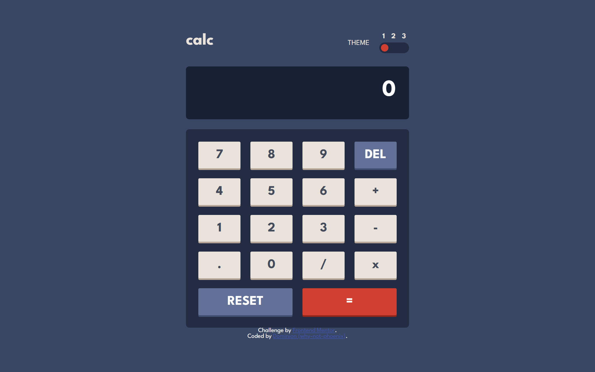
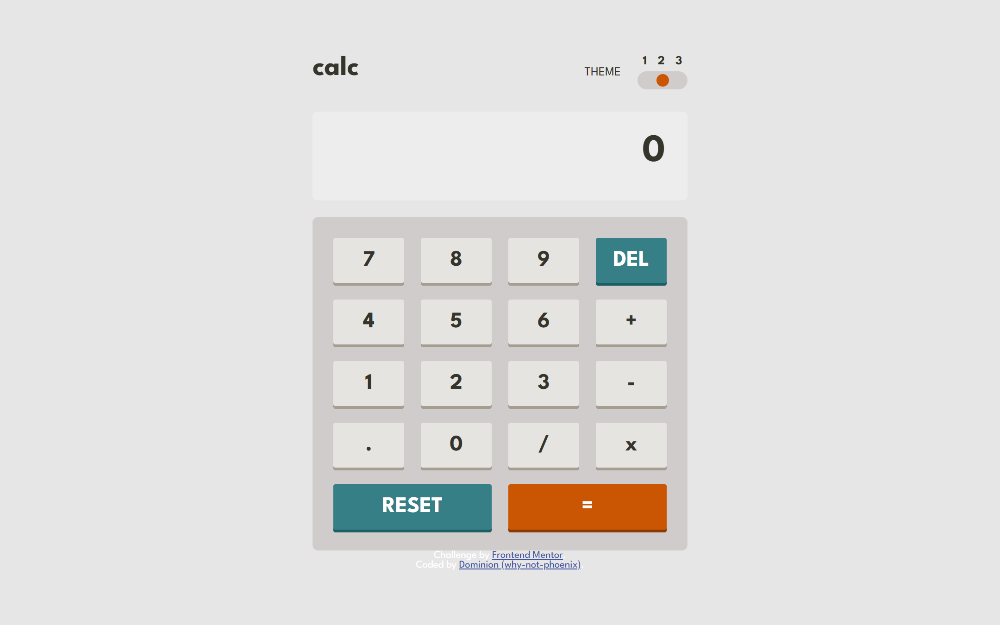
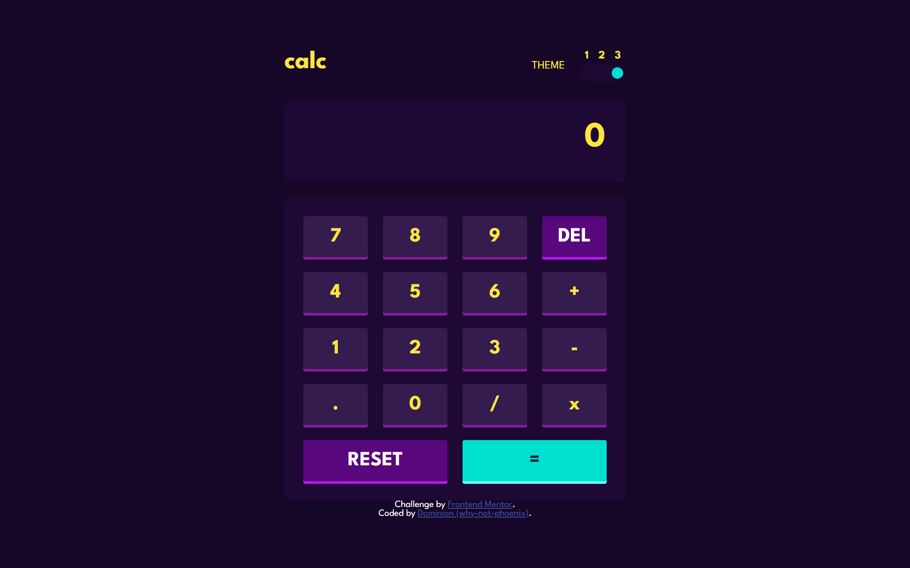
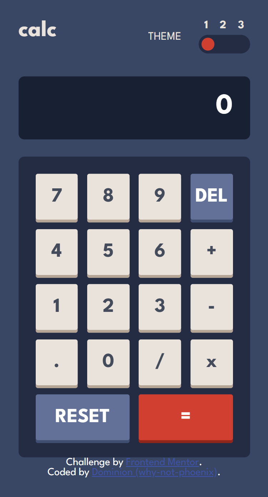
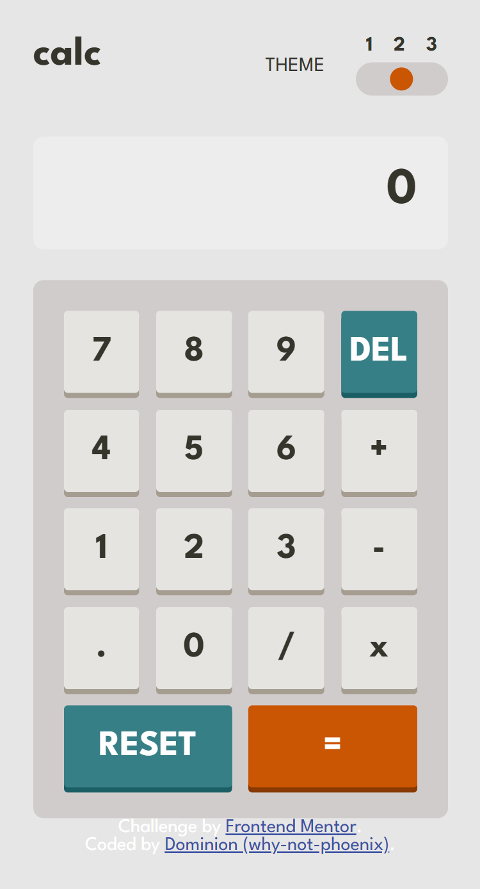
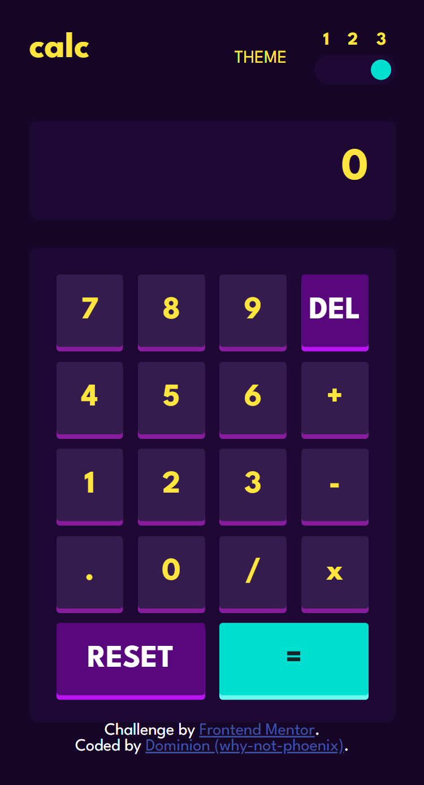

# Frontend Mentor - Calculator app solution

This is my solution to the [Calculator app challenge on Frontend Mentor](https://www.frontendmentor.io/challenges/calculator-app-9lteq5N29).

## Table of contents

- [Overview](#overview)
  - [The challenge](#the-challenge)
  - [Screenshot](#screenshot)
  - [Links](#links)
- [My process](#my-process)
  - [Built with](#built-with)
  - [What I learned](#what-i-learned)
  - [Continued development](#continued-development)
- [Author](#author)
- [Acknowledgments](#acknowledgments)

## Overview

### The challenge

Users should be able to:

- See the size of the elements adjust based on their device's screen size
- Perform mathematical operations like addition, subtraction, multiplication, and division
- Adjust the color theme based on their preference
- **Bonus**: Have their initial theme preference checked using `prefers-color-scheme` and have any additional changes saved in the browser

### Screenshot

Desktop

Mobile

### Links

- Solution URL: [https://www.frontendmentor.io/solutions/responsive-simple-calculator-application-MR5j3A60dm](https://www.frontendmentor.io/solutions/responsive-simple-calculator-application-MR5j3A60dm)
- Live Site URL: [https://why-not-phoenix.github.io/simple-calculator-app/](https://why-not-phoenix.github.io/simple-calculator-app/)

## My process

### Built with

- Semantic HTML5 markup
- CSS custom properties
- Flexbox
- CSS Grid
- Mobile-first workflow
- Vanilla JavaScript
- CSS transitions and animations

### What I learned

I used the challenge mainly to work on my Js skills. I dynamically added buttons using JS. I knew how to do that but in terms of a calculator where the pattern isn't as straightforward I had to learn different methods of adding the buttons.

I was proud of the fact that I completed most of this project on my own (w/o assistance from AI). I did have to seek help on forming the pseudocode for the theme persistence logic and also figuring out some bugs but for the most part I developed what I wanted to do and found ways to do them my way. For this reason, there might be parts of my solution that could be optimized but I'm happy to learn organically and take this step by step.

The theme toggle functionality was also something I learned. It wasn't as hard as I initially feared, and I was able to figure it out.

### Continued development

I need to learn more ways to make my HTML and code functions more accessible.
Need to get a better grasp of things to make my code more concise and dynamic
React.js

## Author

- Frontend Mentor - [@why-not-phoenix](https://www.frontendmentor.io/profile/why-not-phoenix)
- Twitter - [@dominion_onoja](https://www.twitter.com/dominion_onoja)

## Acknowledgments

Thanks to my brother (Great) for testing my calculator and noticing some bugs and also Codex and Github Copilot for assisting
